## 1. **Problem statement**
The problem that the project addresses is to design a benchmark suite that can work with complex Machine Learning (ML) / Deep Learning (DL) inference jobs. The benchmark suite should consist of at least four different pipelines on Apache Flink. We also need to run these pipelines in an embedded and an external model serving strategy.
  
Once we get the benchmark, we need to design and execute a performance evaluation study (like [paper #1](#71-paper-1)) of our suite by Apache Flink, ML Frameworks, and Interoperability Libraries.

- Why is it important?
  - Though [paper #1](#71-paper-1) have evaluated these two strategies on Apache Flink, it is still unclear how serving would perform on Apache Flink for **complex** pipelines with more than one inference operator. Our project is important for us to understand the performance difference between embedded and externel model serving strategies when we need to deploy complex ML/DL pipelines.
- Who will benefit when the problem is solved?
  - Researchers, scientists, software engineers and data analysts who want to deploy ML/DL jobs that require multiple ML/DL pipelines with more than one models. Our results can help them determine which model serving strategy will be the best fit for their needs.

## 2. **Proposed Solution**

### 2.1 Hypothesis

The conclusion in [paper #1](#71-paper-1) may not hold, the latency may be increased significantly with larger batch size with larger ML/DL pipeline sizes, while other metrics may still hold. Additionally, using external frameworks optimized for certain processors can yield better performance w.r.t latency and throughput. For example, OpenVINO models are optimized for fast inference on Intel CPUs/GPUs.

Moreover, with more edges in the pipeline (determined by different shapes), the latency in external serving may also be increased more than embedding serving.

We make this hypothesis due to the following analysis:
1. With increased size of a pipeline (i.e. more nodes), the newtork cost for the stream processor to communicate with worker processes will be increased as well. For instance, in [paper #1](#71-paper-1), the stream processor only needs to commmunicate with one worker process, but if we have a pipeline with four models, the stream processor needs to spend four times network cost to communicate with the worker processes.
2. With increased edges and same nodes in a pipeline, the network cost between different models will also be increased, thus the overall latency should be increased as well.

### 2.2 System Architecture

### 2.3 Design Details
Similar to [paper #1](#71-paper-1), we will use Apache Flink to design and run our stream processing jobs. The major language we will use is Java because it is the default language for Apache Flink. Python will be used on external serving framework because both PyTorch and Tenserflow have easy-to-use python APIs.

RPC requests will be heavily used in the communication between stream processors and external serving framework. In addition, communication between different worker processes will also use RPC requests.

gRPC would be a good choice for RPC requests because it is well developed, support both Java and Python, messages sent by gRPC are also highly compressed by ProtocolBuffer which can minimize our network overhead.

Like what we showed in [System Architecture](#22-system-architecture), in embedded serving approach, different ML/DL pipelines are loaded into the stream processor's memory, the results from previous model will be the input to the next model. In external serving framework, each model will be executed in a single worker process, once the previous model is done, the results will be sent to the next one by gPRC. We can always scale our worker processes if we need for both vertical and horizontal scale.

Our system needs to support different size of pipelines, while horizontally scaling up, we need to replicate the whole pipeline. Similar to [paper #2](#72-paper-2), the pipelines should be represented as directed acyclic graphs (DAGs) because many complex ML/DL pipelines require using multiple outputs from previous models as input to the next models, in DAGs, each node corresponds to a model or a transformation.

Since we are going to have four different pipelines, our proposed pipelines are shown like below:

Colored circles 1, 2, 3, 4 are four different models / transformations we will use. These pipelines are completely different from each other, though part of them are overlapped. Through these pipelines, we can do our experimental study on different sizes and shapes of pipelines, explore how the sizes and shapes of pipelines can affect the metrics.

[OPTIONAL] We may also need to design a job planner or tunner similar to [paper #2](#72-paper-2) to balance our workload, auto-scale, minimize the cost and latency. However, these may be our optional features due to the high complexity, we can explore more if we still have enough time after completing our basic requirements.

## 3. **Expectations**
- A more efficient network communication approach by using gRPC to minimize network overhead. HTTP with JSON may involve extra network cost in data packets.
- More flexible and scalable in external serving framework since we can support DAG pipelines and horizontal scaling.
- Comprehensive evaluation on the **complex** ML/DL pipelines performance between embedded serving and external serving approaches while using Apache Flink.
- Our benchmark suite should show the `latency` in external serving is larger than the embedding serving for the same batch size while the size of a pipeline is increased.
- Compare to [paper #1](#71-paper-1), our benchmark suite should show the `latency` in external serving is larger than the embedding serving for the larger batch sizes while the size of a pipeline is increased to a specific number (e.g. 4).
- Given a pipeline with a fixed number of nodes, similar to [paper #1](#71-paper-1), our benchmark suite should show the `throughput` in external serving lower than the embedding serving, , this will still hold in scale-up experiments.
- Given a pipeline with a fixed number of nodes, more edges will show the `latency` in external serving lager than embedding serving since the network work cost between each node will increase.

## 4. **Experimental Plan**

### 4.1 Measurements
Similar to [paper #1](#71-paper-1), our measurements will be:
- Average Throughput (req/s) by Input Rates (req/s)
- Average Latency by Batch Size (images/batch)
- Average Throughput by Vertical Scalability
- Average Throughput by Horizontal Scalability

### 4.2 Experiments
We will use the similar serving tools in [paper #1](#71-paper-1).

**Embedded Serving Tools:** ONNX, ND4J, TF-SavedModel.

**External Serving Tools:** TorchServe, TF-Serving, OpenVINO Model Server.

In addition to the similar experiments as [paper #1](#71-paper-1), we also need to setup extra experiments for all pipelines. Therefore we can get the experiments data for throughput, latency and scalability for all pipelines eventually.

### 4.3 Datasets
Depends on the models we will use, we can use either synthetic dataset or [Mask Wearing Dataset](https://public.roboflow.com/object-detection/mask-wearing).

### 4.4 Model candidates
We are not able to determine the models until we define our ML/DL pipelines, however there are some model candidates that we can use.
- Image classification: [MobileNet V1](https://huggingface.co/google/mobilenet_v1_0.75_192)
- Object detection: [YOLOS (tiny-sized) model](https://huggingface.co/hustvl/yolos-tiny)
- Image segmentation: [MaskFormer](https://huggingface.co/facebook/maskformer-swin-tiny-ade)
- Translation: [T5 Small](https://huggingface.co/t5-small)
- Text-Image generation: [Stable Diffusion v1-5](https://huggingface.co/runwayml/stable-diffusion-v1-5)
- Image-Image variants: [Stable Diffusion Image](https://huggingface.co/lambdalabs/sd-image-variations-diffusers)

We will determine our pipelines based on the above models (or introduce new new models).

### 4.5 Where to deploy
Local machines for development and testing.

VMs on [Chameleon Cloud](https://www.chameleoncloud.org/) for experimental study.

OpenVINO Model Server should be tested on both Intel and non-Intel machines to measure performance differences.

### 4.6 How to collect measurements
Once a experiment has done on a pipeline, we can write `Python` scripts to collect the measurements from the data sink.

### 4.7 How will the collected measurements confirm (or deny) the hypotheses
If the latency metric for most of the pipelines in external serving approach higher than the embedded serving approach, and other metrics hold the same as [paper #1](#71-paper-1), then we can safely confirm the hypotheses. By measuring performance differences between different systems on OpenVINO model serving, we can confirm if processor-optimized frameworks are more beneficial.

## 5. **Success Indicators**
### 5.1 Outcome
1. A benchmark suite of Machine Learning inference model which consists of at least four different **complex** pipelines.
2. A comprehensive evaluation on the performance between embedded serving and external serving approaches to our pipelines.

### 5.2 Milestones: 
1. Finish the basic project setup.
2. Build the DAG pipelines for each serving strategy.
   - Run and test on the local environment.
3. Deploy the benchmark suite to Cloud and run experimental study.
4. Finish experimental study.

### 5.3 Completion signs
- Successfully built and deploy the project.
- Complete all the required features in [Design Details](#23-design-details).
- Complete and deploy the experiment setup.

### 5.4 Measures for success
- No crashes while running the system for at least 99% running time (i.e. our SLO is >= 99%).
- Successfully design and deploy different kinds of ML/DL pipelines.
- Successfully collect the required metrics and generate the corresponding diagrams.
- Successfully derive the solid conclusion to confirm (or deny) our hypotheses.

We can safely declare our success on this project if we can generate the experiments result diagrams for at least 4 different kinds of pipelines.

## 6. **Task assignment**
### 6.1 Task breakdown
1. Determine pre-trained models. `No dependency`
2. Data preprocessing (filter, crop etc.). `No dependency`
3. Setup basic project structure. `No dependency`
4. Implement non-DAG pipelines. `Depends on`: 3
5. Implement DAG pipelines. `Depends on`: 3, 4
6. Implement embedded serving pipelines. `Depends on`: 3, 4, 5
    - Supports for:
      - ONNX
      - ND4J
      - TF-SavedModel
    - Implement in DAG pipelines.
7. Implement external serving pipelines (include RPCs). `Depends on`: 3, 4, 5
    - Supports for:
      - TorchServe
      - TF-Serving
      - OpenVINO Model Server
    - Implement in DAG pipelines.
8. Code deployment and testing (Deploy to Cloud VMs). `Depends on`: 1, 2, 3, 4, 5, 6, 7
9. Experimental study. `Depends on`: 1, 2, 3, 4, 5, 6, 7, 8

> Task 1, 2, 3 can be paralleled. Task 6, 7 can also be paralleled after finishing 3, 4, 5.

### 6.2 Task assignees
| Task No. | Assignee | Strengths | Weaknesses|
| --- | --- | --- | ---|
| 3, 4, 5, 6, 7 | Jingwei Zhang | Interdisciplinary background, previous projects experience, Java, Python | Sometimes does not have not extra energy to pay attention on details with heavy workload|
| 1,2,3,5,9 | Jingyi Li | ML model experience using Python| Haven't worked on any large-scale ML projects and streaming pipelines before, but can learn how to do that|
| 2,3,5 | Liyu Qu |Java, Small ML (NPL) project experience using Python |Not familiar with large stream system and implement pipelines (but can learn to do that) |
| 1,2,8 | Sandesh Bharadwaj | Java, Python, Kafka, Experience with large codebases| Haven't worked on streaming pipelines before, but can manage |
| 1,2,3,4,6 | Mani Mukesh Reddy Nukal | Experience with Java, Python | Getting started with streaming tools so a bit slow in the beginning |
| 1,2,3,4,7 | Pranay Narne | Strong at neat and effiecient Python and Jave implementations | Haven't worked on the streaming systems before |

## 7. **References**
### 7.1 Paper 1
[1] Horchidan, S., Kritharakis, E., Kalavri, V., & Carbone, P. (2022, June). Evaluating model
serving strategies over streaming data. In Proceedings of the Sixth Workshop on Data
Management for End-To-End Machine Learning (pp. 1-5).
https://dl.acm.org/doi/pdf/10.1145/3533028.3533308

### 7.2 Paper 2
[2] Crankshaw, Daniel, et al. "InferLine: latency-aware provisioning and scaling for prediction
serving pipelines." Proceedings of the 11th ACM Symposium on Cloud Computing. 2020.
https://dl.acm.org/doi/pdf/10.1145/3419111.3421285
