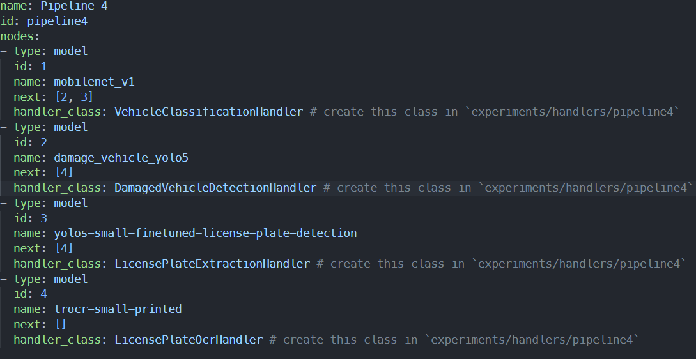

Flink Complex ML Benchmark Suite
===

> Currently this suite only supports TorchServe, but it can be extended tp support other serving frameworks easily.

## How to run experiments?

### Prerequisites
  - JDK 11
  - Apache Maven 3.9
  - Docker
  - Linux
  - Bash

> If your system is a clean system and does not have prerequisites, you can run `sudo ./scripts/experiments/setup_env.sh` to install the neccessary prerequisites.

Don't forget to add the current user to docker group to avoid TorchServe build failures:
```
sudo groupadd docker
sudo usermod -aG docker $USER
```
Log out and log back or run `newgrp docker` to activate changes above.

### Steps
1. Follow [TorchServe Instructions](../external-serving/torchserve/README.md) to bring up TorchServe service.
2. Change working directory to `/{project-root}/scripts/experiments/`.
3. Execute `./run_all_exps.sh`, waiting for it to be finished, it may take more than 12 hours.
4. Results will be saved to `/tmp/experiments_results`.
5. Run `./compute_metrics.py` to compute the metrics from the results, you will need to put the `/tmp/experiments_results` into `/{project-root}/assets/experiments/results` before run this script.

> If you want to keep the job running after logging out system, execute `nohup ./run_all_exps.sh 2>&1 > exps.log &`

That's it! Easy-peasy!

## How to build?

1. Change working directory to `/{project-root}/scripts/`.
2. Execute `./build.sh`

## How to run Unit Tests

> Don't forget to run TorchServe before running Unit Tests, otherwise some Unit Tests will fail.

1. Change working directory to `/{project-root}/scripts/`.
2. Execute `./run_tests.sh`

## How to run the built artifact on Flink Cluster?

1. Execute `/path/to/flink-bin-dir/start-cluster.sh`
2. Execute `/path/to/flink-bin-dir/flink run codebase/flink-complex-ml-benchmark/target/flink-complex-ml-benchmark-0.0.1.jar`

## Define a new Pipeline

`FLINK_MAIN=src/main/java/edu/bu/cs551/team8`

1. Create a new YAML file in `src/main/resources`
2. In `src/main/resources/config.properties`, set `pipelineConfigPath` to your new YAML file name.
3. Use the sample YAML file to start `src/main/resources/pipeline4.yaml`
4. Create model handler class file for each model, put them in the `{FLINK_MAIN}/experiments/handlers/<pipeline-id>`, e.g. the model handlers of `src/main/resources/pipeline4.yaml` are located in `{FLINK_MAIN}/experiments/handlers/pipeline4`.
5. If you DON't want to preprocess/postprocess any data before/after inference, you don't need to override any functions in `BaseHandler`, once your handler class extends the `BaseHandler`, the default behavior is carrying the results and data from the previous model to the next one.
6. If you DO want to preprocess/postprocess any data before/after inference, you will need to override `preprocess` and `postprocess` functions in `BaseHandler`.

## Support a new serving framework

Let's say your new serving framework is `XYZ`.
### If it is an embedded serving framework (haven't done yet)
1. Create a new ModelNode file in `{FLINK_MAIN}/pipelines/nodes`, say `XYZModelNode.java`, extends `EmbeddedModelNode`
2. Create a new Model file in `models`, say `XYZModel.java`.
3. Create a concrete Pipeline class in `{FLINK_MAIN}/pipelines`, say `XYZPipeline.java`, extends `EmbeddedPipeline`.
4. Refer to `ONNXPipeline.java` for an example to implement your codes.
5. Basically, your new framework pipeline needs to override `run` function in `Pipeline` base class.

### If it is an external serving framework
1. Setup external serving server.
2. Create a new ModelNode file in `{FLINK_MAIN}/pipelines/nodes`, say `XYZModelNode.java`, extends `ExternalModelNode`
3. Create a concrete Pipeline class in `{FLINK_MAIN}/pipelines`, say `XYZPipeline.java`, extends `ExternalPipeline`.
4. Refer to `TorchServePipeline.java` for an example to implement your codes.
5. Basically, your new framework pipeline needs to override `run` function in `Pipeline` base class.

## Advantages
1. Define pipelines easily.
    - Simply define a pipeline in a YAML file can create a new pipeline shape. This framework will automatically build the DAG stream for any defined pipelines. The following example will define a pipeline with shape 4 (in our design doc):
    
2. Shared Model Handlers.
    - After defining a pipeline, the only thing we need to do is creating corresponding model handler class for each model. If we don’t want to parse responses from the model, the data can be simply carried into next model, but if we want, we can write our processing (preprocess, postprocess etc.) logic in the handler file.
    - This kind of handler file can be shared across all the frameworks since the model will return the same results regardless the framework we are using.
3. Consistent Behavior.
    - Codes difference during implementing different framework stream DAGs may have impacts on the final performance, by generalizing pipelines, we can minimize this kind of impacts to the specific model framework support. E.g. `TorchServeModelNode` class implements the inference logic for torchserve, `ONNXModelNode` class implements the inference logic for `onnx`.
4. Easy scale
    - If we want to manage model results outside the Flink, we need to handle all the scalability issues, but we don’t need to worry about it if we manage models in the Flink. Simply increase the parallelism can help us scale up.